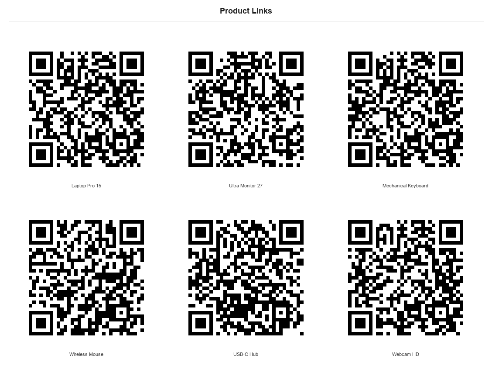
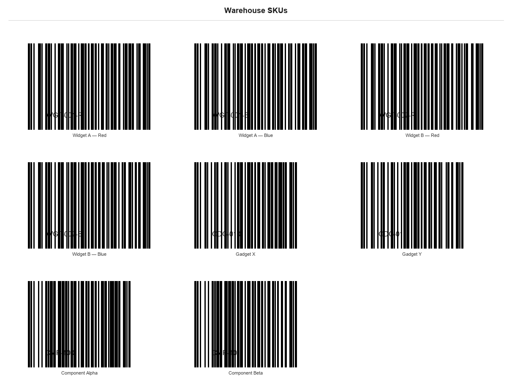

# QR & Barcode Generator

Generate QR codes and 1D barcodes from any data — URLs, product IDs, record
links, or free text. Pass a single item or a list; get back a labelled PNG
sheet, optional individual PNGs per code, and an optional CSV.

Runs **fully offline** in the Python sandbox. No extra `pip install` — uses
`reportlab` and `Pillow`, both pre-installed.

## Sample output

**QR code sheet** — 6 product page URLs, auto-detected as QR:



**Barcode sheet** — 8 warehouse SKUs, Code128:



## What you get

| Output | Flag | Notes |
| --- | --- | --- |
| PNG sheet | *(always)* | Labelled grid — inline in markdown |
| Individual PNGs | `individual: true` | One PNG per code — useful for per-record workflows |
| CSV | `csv: true` | `#, label, data, kind, file_path` |

**All exports except the sheet are off by default.** Every response includes an
"Optional exports" hint listing unused flags.

## Two code kinds

| `kind` | Best for | Auto-detected when |
| --- | --- | --- |
| `qr` | URLs, long text, mobile scanning | data starts with `http(s)://` or is > 25 chars |
| `barcode` | Short IDs, product codes, legacy scanners | short alphanumeric data |
| `auto` | Mixed lists | *(default)* — resolved per item |

## Barcode types (`barcode_type`)

| Value | Symbology | Data rules |
| --- | --- | --- |
| `code128` | Code 128 (default) | Any ASCII |
| `code39` | Code 39 | A-Z, 0-9, `- . $ / + %` |
| `ean13` | EAN-13 | Exactly **13 digits** |
| `ean8` | EAN-8 | Exactly **8 digits** |
| `upca` | UPC-A | Exactly **12 digits** |
| `i2of5` | Interleaved 2-of-5 | Even number of digits |

## Layout options

| `layout` | Description |
| --- | --- |
| `auto` | `single` for 1 item, `grid` for multiple *(default)* |
| `single` | One code, centred |
| `grid` | N-column grid; `columns` sets width (auto if omitted) |
| `strip` | Single-column vertical list — good for label sheets |

## Before you start

`reportlab` and `Pillow` must be available in the sandbox.  Both are
pre-installed — nothing extra to install.

## How to use it

### 1. Single QR code from a URL

Just ask:
> Give me a QR code for https://teams.microsoft.com/l/channel/19%3Ameeting_abc123

The agent passes:
```json
{ "kind": "qr", "data": "https://teams.microsoft.com/l/channel/19%3Ameeting_abc123", "label": "Team Channel" }
```
You get a single centred QR code PNG, ready to paste or share.

---

### 2. QR code sheet for a list of links

> Generate QR codes for our Sydney, Melbourne, and Brisbane office check-in pages.

```json
{
  "kind": "qr",
  "title": "Office Check-in QR Codes",
  "items": [
    { "label": "Sydney",    "data": "https://checkin.contoso.com/sydney" },
    { "label": "Melbourne", "data": "https://checkin.contoso.com/melbourne" },
    { "label": "Brisbane",  "data": "https://checkin.contoso.com/brisbane" }
  ]
}
```
Result: a 3-column labelled grid sheet, inline in the chat.

---

### 3. Warehouse barcode sheet (Code128)

> Make Code128 barcodes for these SKUs: WGT-001, WGT-002, WGT-003, WGT-004. Print-ready strip layout.

```json
{
  "kind": "barcode",
  "barcode_type": "code128",
  "layout": "strip",
  "title": "Warehouse Pick List",
  "items": [
    { "label": "Widget A", "data": "WGT-001" },
    { "label": "Widget B", "data": "WGT-002" },
    { "label": "Widget C", "data": "WGT-003" },
    { "label": "Widget D", "data": "WGT-004" }
  ]
}
```
Result: a single-column vertical strip with human-readable text below each bar.

---

### 4. Retail EAN-13 barcode sheet

> Generate EAN-13 barcodes for product codes 5901234123457, 4006381333931, 5000112637939.

```json
{
  "kind": "barcode",
  "barcode_type": "ean13",
  "title": "Retail Product Barcodes",
  "items": [
    { "label": "Sparkling Water 500ml", "data": "5901234123457" },
    { "label": "AA Batteries x4",       "data": "4006381333931" },
    { "label": "Sticky Notes 100pk",    "data": "5000112637939" }
  ]
}
```
⚠ EAN-13 requires exactly 13 digits — the agent validates each item and shows a
red placeholder for any that don't match, so the rest of the sheet still renders.

---

### 5. Mixed list — URLs and short codes together

> I have a mix of product page URLs and short internal IDs. Generate codes for all of them.

```json
{
  "kind": "auto",
  "title": "Product Codes",
  "items": [
    { "label": "Laptop Pro",  "data": "https://shop.contoso.com/laptop-pro" },
    { "label": "Mouse",       "data": "https://shop.contoso.com/mouse" },
    { "label": "Spare Part A","data": "SP-4421" },
    { "label": "Spare Part B","data": "SP-4422" }
  ]
}
```
`auto` kind detects URLs → QR codes, short IDs → Code128 barcodes, all on one sheet.

---

### 6. After a Dataverse / CRM query — individual PNGs for Power Automate

> Get all open service accounts from Dataverse, generate a QR code for each record URL, and give me individual PNGs so I can attach them in Power Automate.

```json
{
  "kind": "qr",
  "title": "Service Account QR Codes",
  "individual": true,
  "csv": true,
  "items": [
    { "label": "Contoso Ltd",   "data": "https://org.crm.dynamics.com/main.aspx?id=a1b2c3" },
    { "label": "Fabrikam Inc",  "data": "https://org.crm.dynamics.com/main.aspx?id=d4e5f6" },
    { "label": "Northwind",     "data": "https://org.crm.dynamics.com/main.aspx?id=g7h8i9" }
  ]
}
```
Result:
- `sheet_path` — combined PNG for the chat
- `individual_paths[0]` → `001_contoso_ltd.png`, `[1]` → `002_fabrikam_inc.png`, etc.
- `csv_path` — CSV mapping each label, URL, and file path (ready to feed a Power Automate loop)

---

### 7. Event / meeting QR code — large size, high error correction

> Give me a large, high-quality QR code for our event registration link, suitable for printing on a banner.

```json
{
  "kind": "qr",
  "data": "https://events.contoso.com/register/summit2026",
  "label": "Summit 2026 — Register",
  "size": "large",
  "error_correction": "H"
}
```
`H` level error correction means the code is still scannable even if up to 30% of
it is obscured (by a logo, fold, or wear).

## Good to know

- Validation errors (e.g. wrong digit count for EAN-13) are shown in the cell
  as a red placeholder — the sheet still renders all valid items.
- `auto` kind is resolved **per item** — a mixed list of URLs and short codes
  will produce QR codes for the URLs and barcodes for the short codes.
- For downstream Power Automate flows, add `"individual": true` to get a file
  path per record, then attach or upload each PNG in a loop.
- Lock flags in your agent's system instructions (e.g. `"individual": true`) so
  every call automatically includes the exports your workflow needs.
